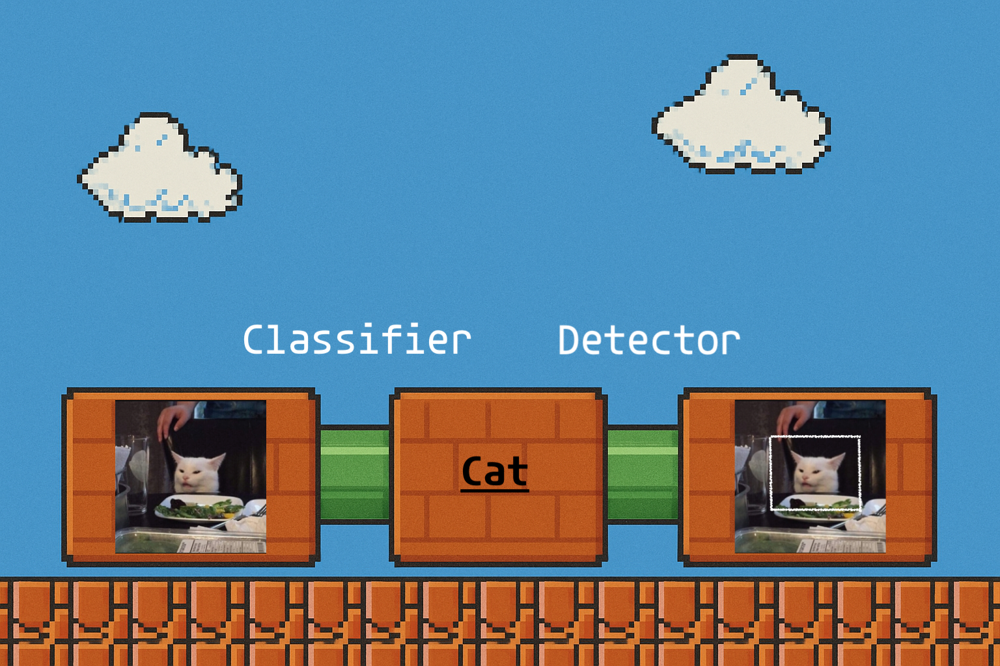

# Computer Vision with Open-Weight Language Models

 

<em>Every serious codebase should have an architecture diagram ...</em>

 

This is a variation of analysis performed for the [Gemini API](https://simedw.com/2025/07/10/gemini-bounding-boxes/) using open-weight* models from Google.

## Results

Classifier Results available [here](https://nenb.github.io/open-weight-computer-vision/static/classifier_dashboard/dashboard.html).

Detector Results available [here](https://nenb.github.io/open-weight-computer-vision/static/detector_dashboard/dashboard.html).

## Design

The results have been vibe-coded saccording to the following requirements:

- The model should be split into a *'classifier'* and a *'detector'* component (I found this helpful for understanding model limitations)
- The model should use `mlx-vlm` for model inference (I have a Mac with 64GB of Unified Memory)
- The results should be shareable via static dashboards

An additional assumption that I also added later to save time is that a model from the `PaliGemma` family must be used for the detector, as these models provide out-of-the-box object detection functionality.

## Development Process

The prompts used to create this repository are contained in `prompts/`. After prompting, I made a small number of edits to the final code produced by the LLM. These were mostly bug fixes - for example, the checkpoint logic was originally implemented using sample IDs from `fiftyone` which were regenerated every time the script was run, preventing the checkpoint logic from working correctly. I replaced them with persistent identifiers.

-----------------------------------

*\*The models used in the default settings for this repository belong to the Gemma family of models whose license does not meet the open source definition. But they are available for experimentation by the open-source community, and allow a similar (ish) comparison to the results from the Gemini API in the original blog.*

